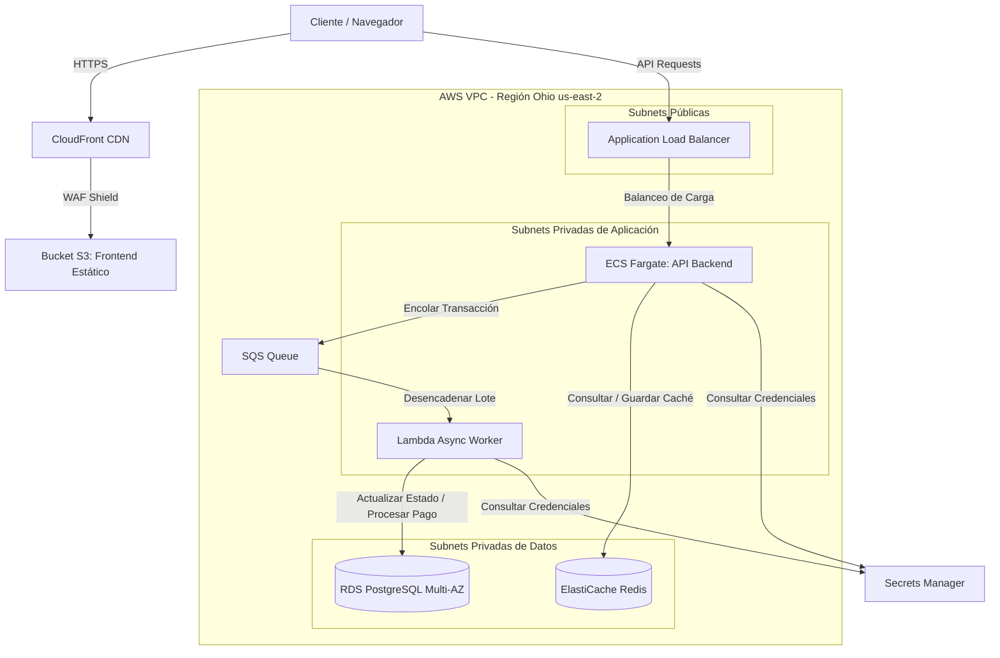

# 🎟️ TicketGo - Infraestructura & Aplicaciones en AWS

¡Bienvenido al repositorio principal de **TicketGo**! Este proyecto contiene la definición completa de la infraestructura en la nube utilizando **Terraform**, así como las aplicaciones que componen la plataforma de venta de tickets. La arquitectura está diseñada siguiendo las mejores prácticas de AWS para lograr alta disponibilidad, escalabilidad automatizada, seguridad robusta y despliegue continuo (CI/CD).

---

## 🏗️ Resumen de la Arquitectura

La plataforma está estructurada en tres capas principales:



### Componentes Clave:
1. **Frontend**: Aplicación en React servida mediante un bucket de Amazon S3 y distribuida globalmente por Amazon CloudFront, protegida por AWS WAF.
2. **Backend API**: Servicio REST construido en ASP.NET Core que se ejecuta sobre Amazon ECS Fargate en subnets privadas, con auto-escalado según demanda.
3. **Procesamiento Asíncrono (Worker)**: Cola de mensajes SQS que recibe solicitudes de compra de entradas y las procesa de manera asíncrona mediante una función AWS Lambda (Node.js) con el patrón `ReportBatchItemFailures` para evitar reintentos innecesarios en mensajes exitosos.
4. **Base de Datos y Caché**: Instancia Multi-AZ de RDS PostgreSQL para almacenamiento persistente y ElastiCache Redis para optimización de consultas de alta frecuencia.

---

## 📂 Estructura del Repositorio

El proyecto está organizado de la siguiente manera:

*   [apps/](file:///c:/Users/USUARIO/Downloads/ticketgo-infrastructure/apps) - Código fuente de los distintos componentes de software.
    *   [apps/api-backend/](file:///c:/Users/USUARIO/Downloads/ticketgo-infrastructure/apps/api-backend) - API REST desarrollada en ASP.NET Core. Ver [Program.cs](file:///c:/Users/USUARIO/Downloads/ticketgo-infrastructure/apps/api-backend/Program.cs).
    *   [apps/web-frontend/](file:///c:/Users/USUARIO/Downloads/ticketgo-infrastructure/apps/web-frontend) - Interfaz de usuario web desarrollada en React y Vite. Ver [package.json](file:///c:/Users/USUARIO/Downloads/ticketgo-infrastructure/apps/web-frontend/package.json).
    *   [apps/worker-async/](file:///c:/Users/USUARIO/Downloads/ticketgo-infrastructure/apps/worker-async) - AWS Lambda Worker en Node.js que procesa las compras asíncronas desde la cola SQS. Ver [index.js](file:///c:/Users/USUARIO/Downloads/ticketgo-infrastructure/apps/worker-async/index.js).
*   [infra/](file:///c:/Users/USUARIO/Downloads/ticketgo-infrastructure/infra) - Configuración de infraestructura como código (IaC) con Terraform.
    *   [infra/environments/prod/](file:///c:/Users/USUARIO/Downloads/ticketgo-infrastructure/infra/environments/prod) - Orquestador y variables del entorno de Producción. Ver [main.tf](file:///c:/Users/USUARIO/Downloads/ticketgo-infrastructure/infra/environments/prod/main.tf).
    *   [infra/modules/](file:///c:/Users/USUARIO/Downloads/ticketgo-infrastructure/infra/modules) - Módulos reutilizables de Terraform estructurados por capas (redes, seguridad, bases de datos, cómputo, etc.).
*   [.github/workflows/](file:///c:/Users/USUARIO/Downloads/ticketgo-infrastructure/.github/workflows) - Configuración de pipelines automatizados de despliegue continuo de GitHub Actions.
*   [docs/](file:///c:/Users/USUARIO/Downloads/ticketgo-infrastructure/docs) - Guías detalladas y documentación técnica. Ver [aws-setup-guide.md](file:///c:/Users/USUARIO/Downloads/ticketgo-infrastructure/docs/aws-setup-guide.md).

---

## 🛠️ Requisitos Previos

Antes de comenzar a trabajar en local o desplegar la infraestructura, asegúrate de tener instalado:

*   [Terraform](https://www.terraform.io/downloads) (Versión `>= 1.5.0`)
*   [AWS CLI](https://aws.amazon.com/cli/) configurado con credenciales de administrador.
*   [Docker](https://www.docker.com/) para compilar imágenes de contenedores locales.
*   [Node.js](https://nodejs.org/) (Versión `>= 18.x`) para desarrollo frontend y worker.
*   [.NET SDK 8.0](https://dotnet.microsoft.com/download/dotnet/8.0) para el desarrollo y depuración del backend.

---

## 🏁 Primeros Pasos tras Clonar (Quickstart)

Si es tu primer día en el proyecto y acabas de clonar el repositorio, sigue este flujo básico para orientarte y configurar tu entorno:

1. **Entrar al directorio del proyecto:**
   Asegúrate de abrir tu terminal en la raíz: `cd ticketgo-infrastructure`.

2. **Verifica tus herramientas locales:**
   Comprueba que tienes instalados Node.js, .NET SDK y Docker (ver sección superior de Requisitos Previos).

3. **Elige qué quieres hacer:**
   * **Opción A: Levantar la aplicación localmente (Para programar/testear).** 
     Si quieres ver la página web y probar la API en tu propia computadora, ve directamente a la sección **[💻 Desarrollo Local](#-desarrollo-local)**. Allí encontrarás los comandos para iniciar cada servicio en terminales separadas.
   * **Opción B: Desplegar la infraestructura en la nube (Para QA/Prod).** 
     Si tu objetivo es crear los recursos reales en Amazon Web Services (Bases de datos, ECS, SQS, etc.), continúa leyendo la sección **[🚀 Guía de Despliegue en AWS](#-guía-de-despliegue-en-aws)**.

4. **Autenticación AWS (Opcional en local):**
   Por defecto, el código local puede funcionar con datos simulados. Si decides integrar tu entorno local con los servicios reales de AWS, asegúrate de tener tu terminal autenticada ejecutando `aws configure` e ingresando tus credenciales IAM.

---

## 🚀 Guía de Despliegue en AWS

Para desplegar la infraestructura completa de TicketGo en AWS, sigue estos cuatro pasos principales:

### Paso 1: Configurar el Estado Remoto de Terraform y SSL
Antes de ejecutar los scripts principales de Terraform, debes preparar el almacenamiento seguro para el estado de la infraestructura y el certificado SSL en AWS.
1. Crea un bucket de S3 exclusivo para almacenar el archivo `terraform.tfstate`.
2. Crea una tabla en DynamoDB llamada `ticketgo-tfstate-lock` para evitar colisiones de despliegue.
3. Solicita un certificado SSL/TLS en **ACM (AWS Certificate Manager)** dentro de la región `us-east-1` (obligatorio para CloudFront).

> [!NOTE]
> Encontrarás los comandos CLI detallados y pasos de validación en la guía interna [docs/aws-setup-guide.md](file:///c:/Users/USUARIO/Downloads/ticketgo-infrastructure/docs/aws-setup-guide.md).

Pega los valores correspondientes en:
*   El backend de [infra/environments/prod/providers.tf](file:///c:/Users/USUARIO/Downloads/ticketgo-infrastructure/infra/environments/prod/providers.tf) (nombre de tu bucket S3).
*   La variable `acm_certificate_arn` dentro de [infra/environments/prod/terraform.tfvars](file:///c:/Users/USUARIO/Downloads/ticketgo-infrastructure/infra/environments/prod/terraform.tfvars).

---

### Paso 2: Configurar Secretos en GitHub (CI/CD)
El despliegue de las aplicaciones e infraestructura está completamente automatizado. Para ello, accede a la pestaña de **Settings > Secrets and variables > Actions** de tu repositorio de GitHub y añade los siguientes secretos:

| Secret Name | Descripción / Valor Recomendado |
|-------------|---------------------------------|
| `AWS_ACCESS_KEY_ID` | Access Key ID del usuario IAM con permisos de deployer en AWS. |
| `AWS_SECRET_ACCESS_KEY` | Secret Access Key del usuario IAM. |
| `TF_VAR_db_username` | Nombre de usuario administrador para la base de datos RDS PostgreSQL (ej. `ticketgo_admin`). |

---

### Paso 3: Lanzar la Infraestructura con Terraform
Una vez que el estado remoto y los secretos estén listos, puedes aplicar los cambios de infraestructura. En tu terminal, dirígete al entorno correspondiente y ejecuta:

```bash
cd infra/environments/prod
terraform init
terraform apply -auto-approve
```

Este proceso provisionará automáticamente toda la topología de red, grupos de seguridad, base de datos RDS, caché de Redis, recursos de cómputo de ECS, colas SQS, funciones Lambda y la distribución CloudFront de Frontend.

---

### Paso 4: Despliegue Automático de Aplicaciones (CI/CD)
Una vez aprovisionada la infraestructura básica con Terraform, los despliegues de aplicaciones se controlan mediante los workflows de GitHub Actions automáticos ante cambios en ramas principales:

*   **Infraestructura**: Controlado por [.github/workflows/infra-deploy.yml](file:///c:/Users/USUARIO/Downloads/ticketgo-infrastructure/.github/workflows/infra-deploy.yml). Valida los archivos de configuración y aplica los cambios.
*   **Backend API**: Controlado por [.github/workflows/api-deploy.yml](file:///c:/Users/USUARIO/Downloads/ticketgo-infrastructure/.github/workflows/api-deploy.yml). Construye la imagen de Docker, la sube a Amazon ECR y refresca la tarea en ECS Fargate.
*   **Frontend**: Controlado por [.github/workflows/web-deploy.yml](file:///c:/Users/USUARIO/Downloads/ticketgo-infrastructure/.github/workflows/web-deploy.yml). Compila los activos de React con Vite y los sincroniza al bucket de S3, invalidando la caché de CloudFront.

---

## 💻 Desarrollo Local

Para ejecutar el proyecto de forma local y simular el entorno completo, es recomendable abrir **múltiples terminales** (una para cada componente).

### 1. Ejecutar Backend API (.NET Core)
La API expone los endpoints necesarios para el frontend.
1. Abre una terminal y navega a la carpeta del backend:
   ```bash
   cd apps/api-backend
   ```
2. Restaura las dependencias e inicia el servidor de desarrollo:
   ```bash
   dotnet restore
   dotnet run
   ```
3. Accede a la documentación interactiva de Swagger en `https://localhost:7080/swagger` (el puerto puede variar, revisa la consola).

### 2. Ejecutar Frontend (React + Vite)
1. En **otra terminal**, navega a la carpeta del frontend:
   ```bash
   cd apps/web-frontend
   ```
2. Instala las dependencias (solo la primera vez):
   ```bash
   npm install
   ```
3. Ejecuta el servidor local:
   ```bash
   npm run dev
   ```
4. Abre el enlace local proporcionado, típicamente `http://localhost:5173`, en tu navegador.

### 3. Ejecutar Worker Asíncrono (Node.js)
El worker es una función Lambda diseñada para procesar mensajes de AWS SQS. Al no ser un servidor tradicional de ejecución continua, para probarlo localmente debes simular una invocación de Lambda con un evento dummy.
1. En **una tercera terminal**, navega a la carpeta del worker:
   ```bash
   cd apps/worker-async
   ```
2. Instala las dependencias:
   ```bash
   npm install
   ```
3. Para probar la lógica localmente, crea un archivo temporal llamado `test.js` en esa misma carpeta:
   ```javascript
   const { handler } = require('./index');
   
   // Simulamos el evento SQS que la Lambda recibiría
   const dummyEvent = {
     Records: [
       {
         messageId: "local-msg-1",
         body: JSON.stringify({ 
           type: "ticket_purchase", 
           ticketId: "TKT-123", 
           userId: "USR-001", 
           eventId: "EVT-99", 
           quantity: 2 
         })
       }
     ]
   };

   // Define variables de entorno necesarias para uso local
   process.env.AWS_REGION = "us-east-2";
   // process.env.DB_SECRET_ARN = "mocked-arn"; // Descomentar si implementas mock de SecretsManager

   // Ejecutar el handler
   handler(dummyEvent)
     .then(res => console.log("Resultado Lambda:", res))
     .catch(err => console.error("Error Lambda:", err));
   ```
4. Ejecuta el archivo de prueba:
   ```bash
   node test.js
   ```

---

## 🔒 Buenas Prácticas de Seguridad Implementadas
*   **Aislamiento de Recursos**: Toda la lógica de cómputo y base de datos se ejecuta en subnets privadas sin IP pública directa. Solo el ALB y CloudFront están expuestos a Internet.
*   **Gestión de Credenciales Segura**: No se almacenan contraseñas en código duro. Se utiliza **AWS Secrets Manager** para inyectar credenciales dinámicas en tiempo de ejecución tanto para ECS como para Lambda.
*   **Encriptación en Tránsito e Inactividad**: Todo el tráfico entre clientes y la aplicación se fuerza mediante HTTPS/TLS v1.2+. La base de datos y la caché cuentan con encriptación en reposo activada.
*   **Principio de Menor Privilegio**: Los roles IAM asociados a ECS Fargate y Lambda limitan estrictamente las acciones permitidas y los recursos con los que pueden interactuar.
